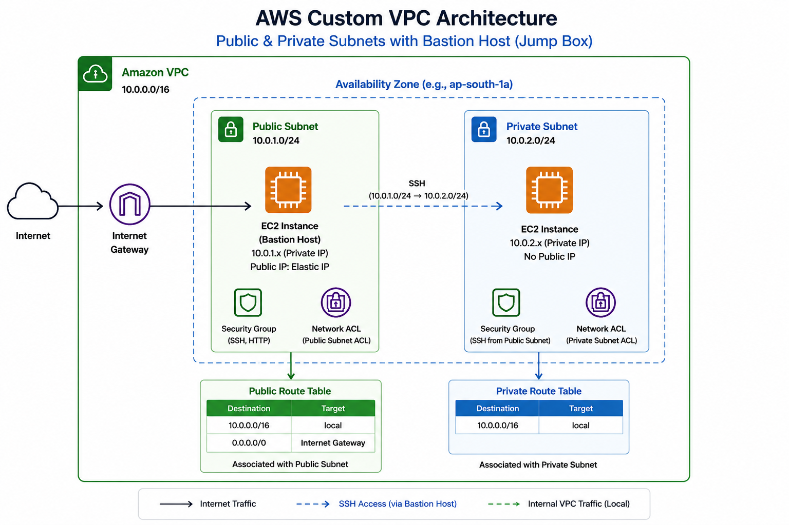

# AWS Custom VPC Architecture
### Public & Private Subnets with Bastion Host (Jump Box)

---

## Architecture Diagram



---

## Overview

This project demonstrates how to design, build, and secure a multi-tier cloud networking infrastructure entirely from scratch on **Amazon Web Services (AWS)**. It covers VPC creation, subnet segmentation, internet connectivity, EC2 deployment, and access control — mirroring real-world production cloud architectures.

---

## Architecture Summary

| Component | Details |
|---|---|
| **VPC CIDR** | `10.0.0.0/16` |
| **Public Subnet** | `10.0.1.0/24` — Internet-facing |
| **Private Subnet** | `10.0.2.0/24` — Isolated, no public IP |
| **Availability Zone** | `ap-south-1a` (or equivalent) |
| **Bastion Host IP** | `10.0.1.x` (Private) + Elastic IP (Public) |
| **Private EC2 IP** | `10.0.2.x` (Private only) |

---

## Components

### 🌐 Amazon VPC
A custom Virtual Private Cloud with CIDR block `10.0.0.0/16` acts as the isolated networking boundary for all resources.

### 🟢 Public Subnet (`10.0.1.0/24`)
- Hosts the **Bastion Host (Jump Box)** EC2 instance
- Assigned an **Elastic IP** for consistent public access
- Accessible from the internet via the **Internet Gateway**
- Security Group allows inbound **SSH** and **HTTP**

### 🔵 Private Subnet (`10.0.2.0/24`)
- Hosts a **private EC2 instance** with no public IP
- Completely isolated from direct internet access
- Accessible only via SSH through the Bastion Host
- Security Group allows inbound SSH **from the public subnet only**

### 🔗 Internet Gateway
Attached to the VPC to provide internet connectivity for resources in the public subnet.

### 📋 Route Tables

**Public Route Table** *(Associated with Public Subnet)*

| Destination | Target |
|---|---|
| `10.0.0.0/16` | local |
| `0.0.0.0/0` | Internet Gateway |

**Private Route Table** *(Associated with Private Subnet)*

| Destination | Target |
|---|---|
| `10.0.0.0/16` | local |

### 🛡️ Security Groups

| Instance | Inbound Rules |
|---|---|
| Bastion Host | SSH (port 22), HTTP (port 80) |
| Private EC2 | SSH (port 22) from `10.0.1.0/24` only |

### 🔒 Network ACLs (NACLs)
- **Public Subnet ACL** — Stateless filtering for public-facing traffic
- **Private Subnet ACL** — Stateless filtering for internal-only traffic

---

## Traffic Flow

```
Internet
   │
   ▼
Internet Gateway
   │
   ▼
EC2 Bastion Host (Public Subnet 10.0.1.0/24)
   │  SSH via internal VPC network
   ▼
EC2 Private Instance (Private Subnet 10.0.2.0/24)
```

- **Internet Traffic** → Internet Gateway → Bastion Host
- **SSH Access** → Bastion Host → Private EC2 (via `10.0.1.0/24 → 10.0.2.0/24`)
- **Internal VPC Traffic** → Routed locally without leaving AWS

---

## EC2 Instances

### Bastion Host (Jump Box)
- **OS:** Amazon Linux
- **Subnet:** Public (`10.0.1.0/24`)
- **Private IP:** `10.0.1.x`
- **Public IP:** Elastic IP assigned
- **Purpose:** Secure entry point for accessing private resources

### Private EC2 Instance
- **OS:** Amazon Linux
- **Subnet:** Private (`10.0.2.0/24`)
- **Private IP:** `10.0.2.x`
- **Public IP:** None
- **Purpose:** Simulates sensitive backend workloads isolated from the internet

---

## Connecting to the Private Instance

```bash
# Step 1: SSH into the Bastion Host
ssh -i your-key.pem ec2-user@<bastion-elastic-ip>

# Step 2: From the Bastion Host, SSH into the Private EC2
ssh -i your-key.pem ec2-user@10.0.2.x
```

> **Tip:** Use SSH agent forwarding (`ssh -A`) to avoid copying private keys onto the Bastion Host.

---

## Key Concepts Covered

- **VPC Design & CIDR Allocation** — Structuring IP address space for scalability
- **Public vs. Private Subnets** — Separating internet-facing and internal workloads
- **Internet Gateway** — Enabling outbound and inbound internet access
- **Route Tables** — Controlling how traffic flows within and outside the VPC
- **Bastion Host Pattern** — Secure, controlled access to private infrastructure
- **Security Groups** — Stateful, instance-level firewall rules
- **Network ACLs** — Stateless, subnet-level traffic filtering
- **Elastic IP** — Static public IP for persistent access to the Bastion Host
- **AWS Local Routing** — Automatic intra-VPC communication via the `local` route

---

## Troubleshooting Notes

During implementation, the following issues were encountered and resolved:

- **SSH key permission errors** — Fixed by running `chmod 400 your-key.pem`
- **EC2 Instance Connect failures** — Diagnosed and corrected security group misconfigurations
- **Blocked ICMP traffic** — Investigated NACL and security group rules blocking ping
- **Internet connectivity tests** — Used `ping` and `curl` to verify outbound access through the Internet Gateway

---

## What's Next

This architecture serves as the foundation for more advanced AWS networking topics:

- **NAT Gateway** — Outbound internet access for private subnet instances
- **VPC Peering** — Connecting multiple VPCs privately
- **Transit Gateway** — Hub-and-spoke connectivity across many VPCs and accounts
- **Hybrid Connectivity** — AWS Site-to-Site VPN and Direct Connect
- **Multi-AZ Architecture** — High availability across multiple Availability Zones
- **AWS PrivateLink** — Private access to AWS services without internet exposure

---

## License

This project is for educational purposes. Feel free to use it as a reference for your own AWS networking labs.
